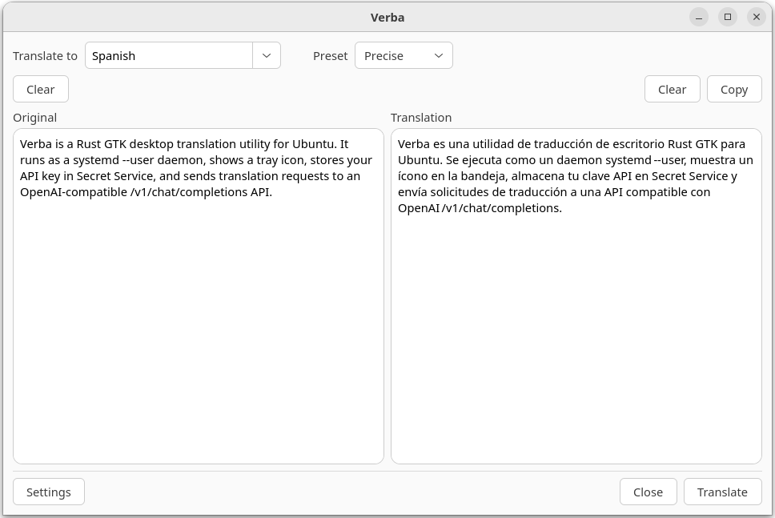

# Verba

Verba is a Rust GTK desktop translation utility for Ubuntu. It runs as a `systemd --user` daemon, shows a tray icon, stores your API key in Secret Service, and sends translation requests to an OpenAI-compatible `/v1/chat/completions` API.

<p align="center">
    
</p>

## Features

- Translation via any OpenAI-compatible API
- `verba toggle` — show/hide the window, ideal for binding a global hotkey
- Presets and a built-in preset editor

## Installation

Download the latest `.deb` from and install:

```bash
sudo dpkg -i verba_1.0.0_amd64.deb
```

## Commands

```bash
verba daemon
verba toggle
verba show
verba hide
verba settings
verba quit
```

`verba daemon` runs the user service. The other commands control the running daemon through the D-Bus session bus.

## Manual installation

Requires Rust toolchain (`cargo`), GTK 4 development libraries, and `pkg-config`.

From the repository root:

```bash
packaging/scripts/install.sh
```

The installer builds the release binary, installs the desktop integration files
under `/usr`, reloads the user systemd manager, and starts the service:

```bash
systemctl --user enable --now verba.service
```

Don't run the whole installer with `sudo`. The script uses `sudo`
when it needs to install files, but `systemctl --user` must run as your graphical user. To install into a temporary prefix for testing, pass `PREFIX` and disable `sudo`:

```bash
PREFIX=/tmp/verba-install SUDO= packaging/scripts/install.sh
```
